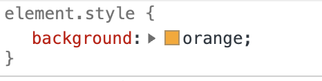

# Chrome Developer Tools

It is the job of a browser (e.g. Chrome, Safari etc.) to take the HTML, CSS and Javascript that a web developer has written, and turn it into a web page.

Most people don't need to worry about how this process works, but if you are in the business of building web pages, it can be useful to get instant feedback on the effect that your code is having on the browser, so that you can produce the results you want.

Browsers usually have 'Developer Tools' that lets you inspect the code that is driving what you see on a web page, see how it works, and even alter the code while it is executing.

Arguably, the best developer tools are found in the Chrome browser.

1. Download Chrome if you don't have it
2. Visit www.google.com
3. Right-click anywhere on the page, and click "Inspect Element". You should see something like this open up, this is the dev tools <b>console</b>:

Notice three things about it:

1. There are lots of <b>tabs</b> available:

    

    We will stay on the "Elements" tab for now. If you get lost somewhere else in console, just click on the "Elements" tab to return back to a screen that looks like the one above.

2.  Lets first look at the panel on the <b>left</b>.
    

    It has lots of <b>tags</b> saying things like `
`, `<script>` and `<style>`. This is what HTML looks like. If you hover over a tag, you are able to see its corresponding visual representation highlighted in <b>blue</b> in the main browser window. By doing this, you should notice that a web page is just a bunch of nested rectangular boxes (in other words, <b>boxes within boxes</b>):

    

3.  Now let's look at the panel on the <b>right</b>.
    

    Here we see the <b>CSS rules</b> for the website. This is what is responsible for making all the rectangular boxes look pretty.

The cool thing is that you are able to <b>edit</b> anything you want about this page. For example, if you see a color rule defined in the CSS panel, and you want to see how the page looks if it is a different color, all you have to do is click on the swatch and it should open up a color wheel that lets you change it to whatever you want.

Now let's try and make Google's home page a garish orange color.

1. In the HTML panel on the left, look for a tag called `<body>`. There is usually only one such tag on a web page.
2. Click on it. You should see the whole page highlighted in blue in the main browser. This is because the `<body>` tag covers the entire surface of the page.
3. Turn your attention to the CSS panel and look at the top of it, where there is a section that says `element.style {}`. This is where the highest precedence styling rules go, in other words, the styles that you specify here are very likely to influence the overall look of the page.
4. Within the curly braces, type: `background: orange`:
   
5. Observe the awesome new Google website design:
   

## Challenge

Pick any website of your choosing and fuck with its design somehow. Delete some stuff, change the colors, change the titles, whatever. The point is just to see what CSS rules serve what effect on a webpage. If you want, you can send me the result. And if you get stuck you can ask me.
